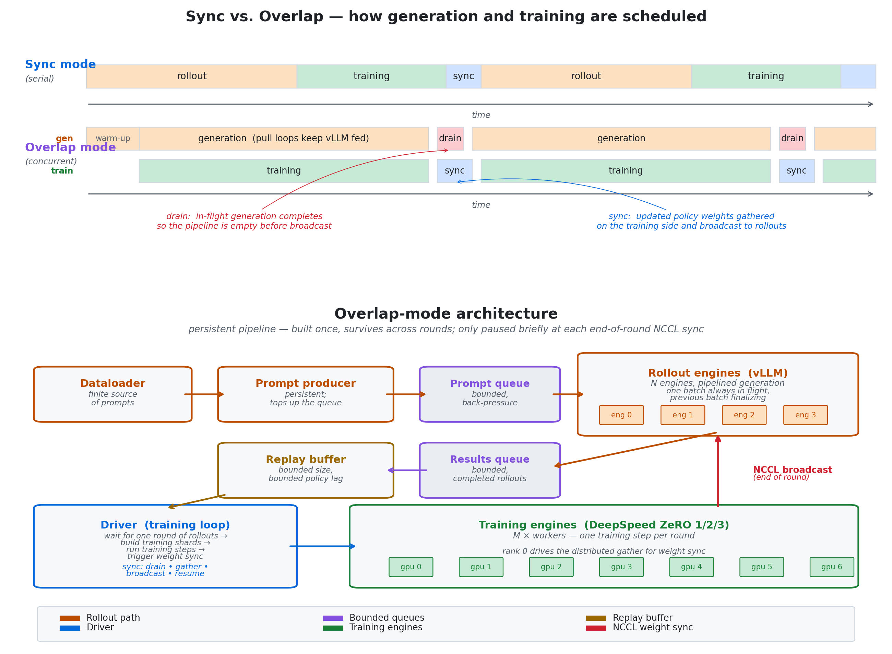

# FeynRL: Shifting the Focus Back to the RL Algorithm

Reinforcement learning has always had a reputation for brittleness. That reputation is not accidental. RL is a particularly general learning framework, but it is also intrinsically difficult: the learner must collect data by acting under a policy, optimize using rewards that are often imperfect or delayed, and repeatedly update the very policy that determines future data. The data is therefore policy-dependent and changes as the policy changes, which makes the problem fundamentally different from the fixed-data setting of supervised learning. As a result, performance can be highly sensitive to reward design, exploration, optimization, and the interaction between data collection and policy improvement.

These difficulties become more pronounced in large models. RL for LLMs and VLMs adds reward models or judges, expensive rollouts, distributed training, orchestration, synchronization, and other heavy systems concerns. Those systems are necessary, but they also shift attention toward throughput and infrastructure. Better systems make large-scale RL feasible; they do not solve RL’s core problems such as reward misspecification, sparse or delayed feedback, credit assignment, exploration, or stale policy-dependent data.

This matters because tooling shapes what gets studied. At large-model scale, even modest algorithmic changes can become substantial systems work. As a result, open-source post-training has concentrated around a relatively narrow class of methods and workflows, partly because they are effective and partly because they are practical to implement in existing stacks. When that happens, many algorithmic ideas become too expensive to test seriously.

FeynRL is motivated by this gap.

FeynRL is not meant to be just another post-training framework, and it is not primarily feature-focused. Its purpose is more specific: to make the systems required for realistic large-model training available while keeping the algorithmic layer as modular, legible, and separable as possible. The goal is to make it easier to study and build new RL methods for large models without turning every algorithmic idea into a large infrastructure project. The same applies in reverse: someone working on the systems side — a new rollout engine, a more efficient async scheduler, a different weight-sync backend — should be able to do that without wading through algorithm code. FeynRL is intended to lower friction on both ends of the spectrum.

That separation of concerns is the central design principle of FeynRL. If someone wants to build a new RL algorithm, they should not need to work through a deeply entangled codebase spanning rollout workers, orchestration, data plumbing, and distributed execution just to change a loss or update rule. Conversely, if someone wants to build a new rollout engine, improve async scheduling, or work on the systems side, they should be able to do that without touching every algorithm implementation. FeynRL tries to keep these pieces as separable as possible so work on one layer does not require rewriting the others.

This is also why FeynRL should be viewed as orthogonal to existing frameworks rather than as a criticism of them. Many current frameworks are strong, highly optimized, and very useful. FeynRL is built around a different tradeoff: it prioritizes clarity, locality of change, and method development rather than the widest possible feature surface. The aim is not to avoid systems work, but to structure it so that it does not dominate the algorithmic layer.

Importantly, this does not mean FeynRL is a toy framework. It is designed to support realistic large-model post-training with the systems needed to run at scale, while remaining interpretable enough that researchers can understand what is happening and modify it without rewriting the whole stack. That point matters because the role of benchmark comparability in this release is only to show that an algorithm-first design does not require falling back to toy experiments.

Concretely, FeynRL supports supervised fine-tuning, preference learning, and reinforcement learning in a shared structure. It includes methods such as SFT, DPO, PPO, GRPO, CISPO, and P3O, together with rollout engines, orchestration, distributed optimization, sync and overlap execution modes, and modular reward, data, and evaluation layers. These features matter not because the project is trying to maximize scope, but because they provide the minimum substrate needed to investigate RL methods seriously at large-model scale while keeping the components separable.

## A closer look at the architecture

Under the hood, FeynRL is organized along three axes that can be worked on independently: **algorithms** (the loss and update rules), **rollouts** (generation, rewards, and replay), and **orchestration** (distributed execution and weight synchronization between the training and inference engines). These layers communicate through narrow interfaces, so a new RL method is usually a new loss and update rule rather than a rewrite of the execution graph. The same configuration system and workflow cover SFT, DPO, and RL, which makes head-to-head comparisons within the framework tractable.

Where algorithms and systems interact most visibly is the training-rollout schedule. FeynRL supports two modes:

- **Sync mode:** each epoch generates all rollouts, trains on them, synchronizes the updated weights to the rollout engines, and repeats. This is fully on-policy, easy to reason about, and the right default when data freshness matters more than throughput.
- **Overlap mode:** generation and training run concurrently on separate GPU pools. A persistent producer continuously feeds prompts to the rollout engines through a bounded queue; each engine keeps generation pipelined so there is always one batch in flight; and a second bounded queue returns completed rollouts to a replay buffer that feeds training. At the end of each round, a single weight synchronization fires: generation briefly drains, the new policy weights are gathered on the training side while the drain completes, broadcast to the rollout engines, and generation resumes. A configurable bound on how far the replay data may lag behind the current policy keeps the staleness-throughput tradeoff explicit rather than emergent.

Sync and overlap compute the same thing; they differ only in how generation and training are interleaved. Sync serialises them for clarity and strict on-policy data; overlap runs them concurrently to reclaim GPU idle time when generation is the bottleneck.

## Results

The initial release benchmarks show the Qwen2.5-1.5B-Instruct run improving average pass@1 from 12.0% to 12.2% and pass@16 from 26.4% to 27.0%, while the Qwen3-4B-Thinking-2507 run moves from 12.2% to 27.0% at pass@1 and from 19.7% to 40.2% at pass@16.

The results set on the homepage will continue to expand as more runs are added.

| qwen2.5-1.5b-instruct | pass@1 | pass@16 |
| --- | ---: | ---: |
| base | 12.0% | 26.4% |
| feynrl | 12.2% | 27.0% |

| qwen3-4b-thinking-2507 | pass@1 | pass@16 |
| --- | ---: | ---: |
| base | 12.2% | 19.7% |
| feynrl | 27.0% | 40.2% |

See [the homepage results section](../index.html#results) for the compact results view.

The motivation for releasing FeynRL is therefore simple. Progress in RL for large models will require more than better systems for running current recipes faster. It will also require infrastructure that makes algorithmic questions easier to isolate, failure modes easier to understand, and new methods easier to build. FeynRL is an attempt to provide that layer: not a replacement for other frameworks, but a framework with a specific purpose.
