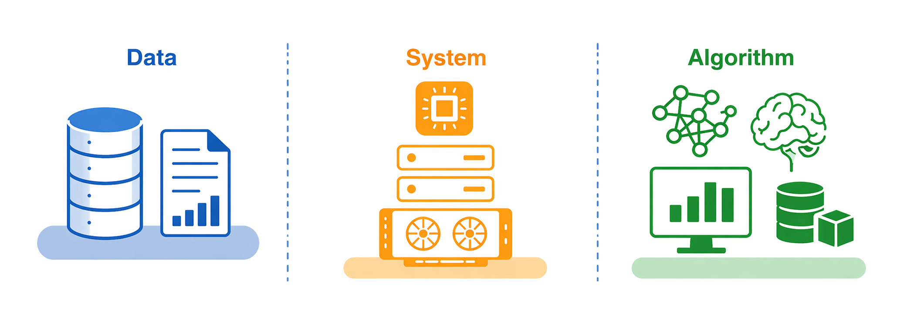
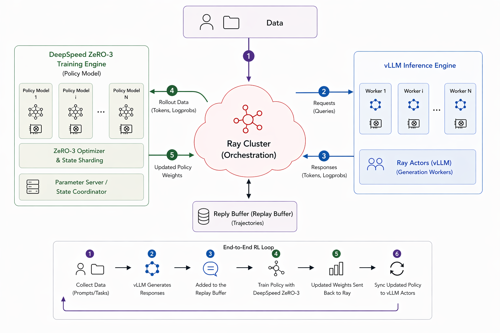
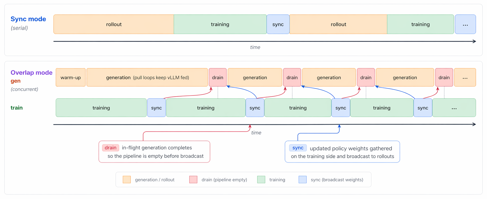
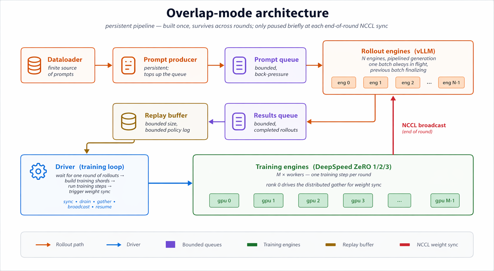

# Don't Let Systems Swallow the Algorithm

Reinforcement learning is structurally harder than supervised learning, and that difficulty shows up as brittleness in practice. In most RL settings, training data is generated by the current policy, so the distribution shifts as the policy changes, unlike the fixed-data setting of supervised learning. At the same time, rewards are often sparse, delayed, or imperfect proxies for the behavior we actually want. As a result, performance is highly sensitive to reward design, exploration, credit assignment, optimization, and the interaction between data collection and policy improvement.

These problems do not disappear in large-model post-training. They are joined by a separate class of systems challenges. RL for LLMs, VLMs, and other large models requires distributed training, orchestration, rollout engines, and reliable coordination between rollout and learning. Better systems expand what is feasible, for example through higher-throughput rollouts, broader sampling, and lower-variance gradients, but they do not by themselves fix the fragile algorithmic side of RL. Some of the hardest issues sit exactly at the boundary between the two layers. Policy staleness from asynchronous rollouts is a clear example: it is created by systems choices but has to be absorbed algorithmically, through truncated importance sampling, trust-region corrections, or similar stabilization mechanisms. That entanglement is exactly why the two layers should be separable.

This matters because tooling shapes what becomes easy to study. When even a modest algorithmic change requires touching rollout code, orchestration, distributed training, and data plumbing all at once, many ideas become too expensive to test seriously. In practice, that pushes experimentation toward methods that already fit the existing stack. That is not a criticism of current frameworks; it is a natural consequence of how costly large-scale RL systems are to build and maintain.

FeynRL Is Motivated by This Gap.

FeynRL gives researchers the systems to run realistic large-model post-training, along with a structure where algorithms, rollouts, and orchestration can be iterated on independently. A new loss is a new loss, a new rollout engine is a new rollout engine, and the rest keeps working. FeynRL is also built with training stability in mind: methods include the practical stabilization details often omitted from other implementations, which are typically what separates an algorithm that works on paper from one that works at scale.

## High-Level Overview

Separation of concerns is the central design principle. Algorithms, rollouts, and orchestration each live behind narrow interfaces, so you can change one without touching the others. At the same time, FeynRL is built for serious large-model post-training, with the systems needed to run real workloads at scale.

Concretely, FeynRL supports supervised fine-tuning, preference learning, and reinforcement learning in a shared structure. It includes methods such as [SFT](https://github.com/FeynRL-project/FeynRL/blob/main/algs/SFT/README.md), [DPO](https://github.com/FeynRL-project/FeynRL/blob/main/algs/DPO/README.md), [PPO](https://github.com/FeynRL-project/FeynRL/blob/main/algs/PPO/README.md), [GRPO](https://github.com/FeynRL-project/FeynRL/blob/main/algs/GRPO/README.md), [CISPO](https://github.com/FeynRL-project/FeynRL/blob/main/algs/CISPO/README.md), and [P3O](https://github.com/FeynRL-project/FeynRL/blob/main/algs/P3O/README.md), together with rollout engines such as [vLLM](https://github.com/vllm-project/vllm), orchestration with [Ray](https://github.com/ray-project/ray), distributed optimization with [DeepSpeed](https://github.com/microsoft/DeepSpeed), sync and async execution modes, and modular reward, data, and evaluation layers. Together these components let you run production-scale RL experiments out of the box, while keeping each layer independently modifiable.

Under the hood, FeynRL is organized along three axes that can be worked on independently: **algorithms** (the loss and update rules), **rollouts** (generation, rewards, and replay), and **orchestration** (distributed execution and weight synchronization between the training and inference engines). These layers communicate through narrow interfaces, so a new RL method is usually a new loss and update rule rather than a rewrite of the execution graph.

## Sync vs Async

Where algorithms and systems interact most visibly is the training-rollout schedule, and FeynRL supports two modes:

- **Sync mode:** each epoch generates all rollouts, trains on them, synchronizes the updated weights to the rollout engines, and repeats.
- **Async mode:** generation and training run concurrently on separate GPU pools.

## Async Mode

In async mode, generation and training run concurrently on separate GPU pools, with bounded queues, replay, and periodic weight synchronization making the throughput-staleness tradeoff explicit.

## Experiments

We have run extensive experiments with FeynRL across a range of models, datasets, and methods. This release surfaces the first set of those results; more will follow on an ongoing basis as the work continues.

Where available, we also include the same-model framework comparison averages from the main repository. It is worth noting that while we do not apply any reward shaping or specific normalization beyond what is discussed in the repository, other frameworks do. Even so, we are already able to obtain results comparable to other common frameworks in this first release.

### [Qwen2.5-1.5B-Instruct](https://huggingface.co/Qwen/Qwen2.5-1.5B-Instruct) on [GSM8K](https://huggingface.co/datasets/openai/gsm8k)

Training data comes from [GSM8K](https://huggingface.co/datasets/openai/gsm8k). Evaluation uses the shared mathematical reasoning benchmark suite reported across the release, spanning [GSM8K](https://huggingface.co/datasets/openai/gsm8k), [AIME](https://huggingface.co/datasets/HuggingFaceH4/aime_2024), [AMC](https://huggingface.co/datasets/AI-MO/aimo-validation-amc), [AMO](https://huggingface.co/datasets/meituan-longcat/AMO-Bench), [Brumo](https://huggingface.co/datasets/MathArena/brumo_2025), [HMMT](https://huggingface.co/datasets/MathArena/hmmt_feb_2025), and [Olympiad-style](https://huggingface.co/datasets/Hothan/OlympiadBench) sets. The framework rows below use the same comparison tables from the main repository; averages use each framework's available reported benchmarks, and the reward snapshot reports the interpolated training reward after 1 hour.

| Run | Pass@1 | Pass@16 | Reward @ 1h |
| --- | ---: | ---: | ---: |
| Baseline | 12.0% | 26.4% | - |
| FeynRL | **12.2%** | 27.0% | **0.894** |
| [AReaL](https://github.com/inclusionAI/AReaL) | **12.2%** | 28.2% | 0.654 |
| [PipelineRL](https://github.com/ServiceNow/PipelineRL) | 10.8% | 26.5% | 0.751 |
| [TRL](https://github.com/huggingface/trl) | 11.3% | **28.6%** | 0.866 |
| [veRL](https://github.com/verl-project/verl) | 10.7% | 27.6% | 0.890 |

### [Qwen3-4B-Thinking-2507](https://huggingface.co/Qwen/Qwen3-4B-Thinking-2507) on [DeepScaler](https://huggingface.co/datasets/agentica-org/DeepScaleR-Preview-Dataset)

Training data comes from the [DeepScaler preview dataset](https://huggingface.co/datasets/agentica-org/DeepScaleR-Preview-Dataset). Evaluation again uses the same benchmark suite, with prompt formatting aligned to the model's released setup. As above, framework averages use each framework's available reported benchmarks from the comparison tables. The FeynRL row below now reflects the latest async-engine evaluation artifacts under `checkpoints/framework_comparisons/qwen3_4b_thinking_2507/wsp/FeynRL_async`, which currently include 8 completed benchmark runs. For Qwen3, the FeynRL reward snapshot below references the async/overlap comparison run and reports the interpolated training reward after 4 hours.

| Run | Pass@1 | Pass@16 | Reward @ 4h |
| --- | ---: | ---: | ---: |
| Baseline | 12.2% | 19.7% | - |
| FeynRL | 27.0% | 40.2% | **0.565** |
| [AReaL](https://github.com/inclusionAI/AReaL) | **37.3%** | **53.4%** | 0.502 |

Explore the [experiments page](../results.html) and [GitHub](https://github.com/FeynRL-project/FeynRL/blob/main/examples/README.md) for detailed information, logs, and scripts to re-run them.
 
