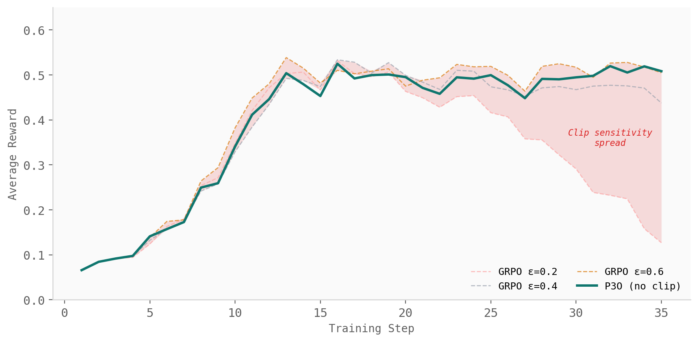
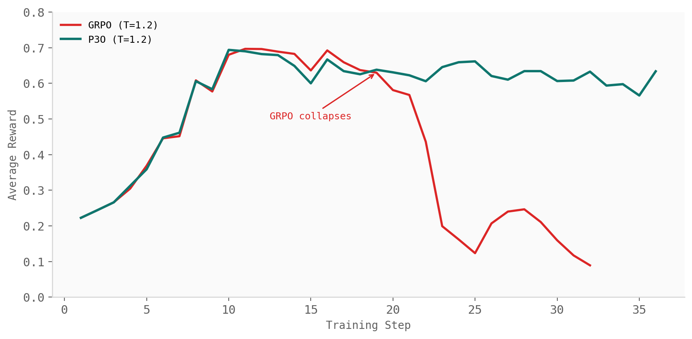
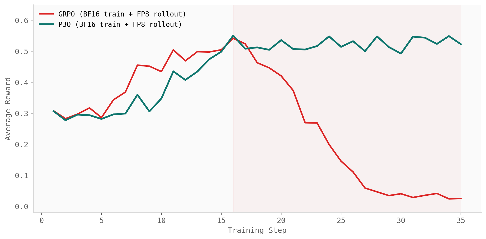

# Trust the Batch

*[Rasool Fakoor](https://rasoolfa.github.io/), Murdock Aubry, Nicholas Stranges, Alexander J. Smola*

Reinforcement learning is often harder to stabilize than supervised learning, and the reason is structural: the policy we are training also shapes the data we train on. As the policy changes, the distribution of examples changes with it. The optimizer is not fitting a fixed dataset; it is chasing a target that keeps moving.

That makes data reuse delicate. When data is generated by the same policy we are currently updating, it is *on-policy*. When it comes from another policy, including an older snapshot of our own model, it is *off-policy*. Off-policy data is not automatically bad, but it is not interchangeable with fresh data either. Treating it as if nothing changed can bias the update; throwing it away wastes expensive rollouts. Much of practical RL lives in this tension: how much old or mismatched data can we trust, and how should the update change when that trust drops?

At large-model scale, this fragility becomes sharper. Rollouts are expensive, runs are long, and tuning costs compound with model scale. Many current methods keep a fixed clip range and build more machinery around it. Decoupled-loss objectives [Hilton et al. 2022], for example, clip the policy ratio against a proximal snapshot of the policy rather than directly against the behavior policy that produced the data, and add a separate cap on the outer behavior weight. That helps, but it also creates new choices: how to construct the snapshot, how long to keep it, and how to set the cap. Change the task, model, or rollout system, and those choices may need to be tuned again.

Our recent work takes the opposite view: do not guess the mismatch before training starts. Measure it from the batch. P3O [Fakoor et al. 2026] treats measurable policy mismatch as a feature, not a burden. The mismatch between the current policy and the behavior policy that produced the batch is already visible in the policy-ratio distribution. P3O reads that signal directly and uses it to decide how much to trust the update. The result is a single batch-adaptive objective that handles fresh and stale data inside the same loss, without introducing a new clip range, behavior-weight cap, or staleness budget.

## The Fix: Measure, Don't Guess

P3O measures the distribution of per-token policy ratios in the current batch. For each token $t$ in batch $\mathcal{B}$,

$$
\rho_t = \frac{\pi_\theta(y_t \mid x, y_{<t})}{\pi_b(y_t \mid x, y_{<t})},
$$

where $\pi_\theta$ is the policy being updated and $\pi_b$ is the behavior policy that generated the data.

If the current policy is close to the behavior policy, the ratios stay nearly uniform. If the batch is stale or mismatched, the ratios spread out and a small number of tokens can dominate. P3O summarizes this with the normalized effective sample size,

$$e_{\mathcal{B}} = \frac{\bigl(\widehat{\mathbb{E}}_{\mathcal{B}}[\rho_t]\bigr)^2}{\widehat{\mathbb{E}}_{\mathcal{B}}[\rho_t^2]} \in \left[\frac{1}{|\mathcal{B}|}, 1\right],$$

where $\widehat{\mathbb{E}}_{\mathcal{B}}$ denotes the empirical average over tokens in the batch. When the ratios are nearly uniform, $e_{\mathcal{B}}$ is close to one. When the batch has drifted and the ratios concentrate, $e_{\mathcal{B}}$ falls. A single statistic tells us how much the batch still looks like data from the current policy.

P3O writes that statistic directly into the loss. With $A_t$ as the token advantage, the P3O objective is

$$
\mathcal{L}_{\mathrm{P3O}}(\theta) = -\widehat{\mathbb{E}}_{\mathcal{B}}\left[\mathrm{sg}\left(\min\{\rho_t, e_{\mathcal{B}}\}\right) \cdot \log \pi_\theta(y_t \mid x, y_{<t}) \cdot A_t\,\right] + (1 - e_{\mathcal{B}}) \cdot \widehat{\mathbb{E}}_{\mathcal{B}}\left[\mathrm{KL}\left(\pi_\theta(\cdot \mid x, y_{<t}) \| \pi_b(\cdot \mid x, y_{<t})\right)\right].
$$

ESS plays two roles. As the cap $\min\{\rho_t,\, e_{\mathcal{B}}\}$, it limits how strongly any token can pull the policy. As the coefficient $(1 - e_{\mathcal{B}})$, it scales a KL regularizer that pulls the current policy back toward the behavior policy when the batch has drifted. Both tighten automatically as the batch becomes less reliable.

On fresh data, $e_{\mathcal{B}}$ is close to one. The cap is loose, the regularizer nearly vanishes, and the update behaves like the usual score-function update. On stale or mismatched data, $e_{\mathcal{B}}$ falls. The cap tightens, the regularizer grows, and the update becomes more conservative. The same loss handles both regimes.

This is the key difference from fixed clipping. A fixed clip range decides before training starts how much mismatch is acceptable. But the right amount of trust is not a constant. It changes with the batch, the model, the rollout engine, the sampling temperature, and the amount of policy staleness. P3O replaces that pre-committed guess with a measurement.

The cap is not just another clip. A clipped surrogate can saturate parts of the gradient once ratios move outside the chosen band, depending on the advantage sign. P3O instead rescales the score-function term by a positive batch-adaptive factor, so tokens still contribute while high-ratio concentration is used as evidence that the batch should be trusted less. The same signal that makes off-policy data dangerous is the signal P3O uses to control the update.

Recent work on fixed clipping has spent its design budget refining the clip itself, with asymmetric ranges, sequence-level versions, proximal snapshots, and separate behavior-weight caps. P3O moves in the opposite direction: it does not look for a better clip, it removes the clip from the objective altogether and lets the batch decide how much each token should be trusted.

| Method | Clip mechanism | Adaptive? | Hyper-parameters |
| --- | --- | --- | --- |
| GRPO [Shao et al. 2024] | Symmetric token-level clip | No | $\epsilon$ |
| DAPO [Yu et al. 2025] | Asymmetric token-level clip | No | $\epsilon_\ell$, $\epsilon_h$ |
| GSPO [Zheng et al. 2025] | Sequence-level clip | No | $\epsilon^{\mathrm{seq}}$ |
| Decoupled loss [Hilton et al. 2022] | Clip against proximal policy + behavior cap | No | $\epsilon_\ell$, $\epsilon_h$, $\pi_{\mathrm{prox}}$, $c_w$ |
| **P3O** [Fakoor et al. 2026] | **No fixed clip; ESS-driven cap** | **Yes** | **None** |

## Experiments: When the Guess Breaks

The core claim of P3O is not that one clip value is better than another. It is that the clip value should not be a fixed guess in the first place. The experiments test exactly that: what happens when the amount of mismatch changes, but the objective still has to decide how much of the batch to trust?

### How Sensitive Can the Clip Range Get?

The first test is simple: keep the setup fixed and sweep the GRPO clip range. We run GRPO with $\epsilon \in \{0.2, 0.4, 0.6\}$ and compare it with a single P3O run. No clip range is tuned for P3O because there is no clip range to tune.

The result is the problem in one plot. GRPO's reward trajectory changes substantially as the clip range changes. A clip that is too small can over-constrain the update; a clip that is too large can allow high-variance ratio terms to dominate. The right value depends on the regime. P3O avoids that choice by reading the batch directly: when the ratios are stable, ESS stays high and the update remains loose; when the ratios concentrate, ESS falls and the update becomes conservative.



On Qwen3-4B-Thinking-2507 and Qwen2.5-1.5B, P3O matches or exceeds the best GRPO clip setting while being run once, with no clip hyper-parameter. The point is not that P3O found a better constant. The point is that the constant disappeared.

### Controlled Off-Policyness: Sampling Temperature

The next question is what happens when the rollout distribution is intentionally shifted. A simple way to do this is to sample rollouts at a temperature different from the one assumed by the training policy. Changing the temperature changes token-level probabilities, which moves the policy ratios away from one and creates off-policy data.

This is exactly where fixed clipping becomes brittle. The clip range was chosen before the batch was seen, so it cannot know whether the current ratios are mostly harmless or badly concentrated. In the paper, GRPO degrades under these temperature-induced shifts, while P3O remains stable because ESS measures the shift from the current batch and adjusts the cap and regularizer accordingly.



This experiment is important because the mismatch is controlled. Nothing exotic is happening: the policy is not replaced by a completely different model, and the task is not changed. The data is simply generated under a different sampling distribution. That alone is enough to expose the weakness of a fixed clip.

### Practical Off-Policyness: BF16 Training + FP8 Rollouts

The more practical version of the same problem appears in large-scale training systems. A common setup is to train in BF16 but generate rollouts using an FP8-quantized policy. This can make rollout generation faster, especially for long completions, but it also means the rollout policy and the training policy no longer assign exactly the same token probabilities. The mismatch shows up directly in the importance ratios.

In the paper, this setting creates a sharp failure mode for GRPO. Under BF16 training with FP8 rollouts, GRPO initially improves but then collapses later in training. P3O continues to train stably under the same training configuration. No new loss, no new tuning rule, no special FP8 correction. The ESS reads the ratio shift from the batch and tightens the update when the batch becomes less reliable.



This is the most important experiment for the systems story. At scale, off-policyness is not just a theoretical concern. It is created by the infrastructure: precision, rollout engines, sampling settings, stale weights, and heterogeneous workers. If the algorithm assumes the data is fresh when the system makes it stale, training can quietly optimize the wrong surrogate.

P3O's message is different: do not pretend the mismatch is not there, and do not hard-code how much mismatch you expect. Measure it.

### Held-Out Benchmark Results

The final check is whether the training-curve advantage translates to held-out task performance. The paper evaluates Qwen3-4B-Thinking-2507 checkpoints on five mathematical reasoning benchmarks (AIME24, AIME25, AIME26, AMO-Bench, and AMC), none of which appear in the DeepScaleR-Preview training set. A condensed view of the pass@1 results is shown below; AIME26 and AMO-Bench track the same trends and are reported in the paper.

| Training method | AIME24 | AIME25 | AMC |
|---|---|---|---|
| *Clip Variants (4K tokens)* | | | |
| GRPO (avg over $\epsilon \in \{0.2, 0.4, 0.6\}$) | **0.176** | 0.160 | 0.381 |
| P3O | 0.165 | **0.183** | **0.493** |
| *FP8 Variants (BF16 train + FP8 rollout, 16K tokens)* | | | |
| GRPO @ iter 15 | 0.154 | 0.250 | 0.499 |
| GRPO @ iter 30 | 0.002 | 0.000 | 0.029 |
| P3O @ iter 15 | 0.158 | 0.237 | 0.478 |
| P3O @ iter 30 | **0.173** | **0.254** | **0.529** |

In the clip-sensitivity block, the GRPO row is an average over three clip settings, and P3O matches or beats it on two of the three benchmarks with no clip hyper-parameter to choose. In the FP8 block, the failure mode visible in the reward curve carries straight through to benchmark performance: GRPO is competitive at iter 15 but collapses by iter 30, with AMC falling from 0.499 to 0.029 and AIME24 from 0.154 to 0.002. Over the same span, P3O continues to improve (AMC 0.478 to 0.529, AIME24 0.158 to 0.173). Same data, same model, same compute. The only difference is the loss reading the batch instead of trusting a clip range.

The broader lesson is simple. Fixed clipping asks the practitioner to guess the trust level before training begins. P3O asks the batch how much it should be trusted.

## FeynRL Made This Possible

All experiments in the paper were run on [FeynRL](https://github.com/FeynRL-project/FeynRL), the algorithm-first post-training framework we introduced in Episode 1. P3O is exactly the kind of result FeynRL was designed to enable: a new objective that does not require rewriting the rollout engine, the orchestration, or the distributed training stack.

FeynRL gives researchers and engineers a structure where algorithms, rollouts, and orchestration can be iterated on independently. A new loss is a new loss, a new rollout engine is a new rollout engine, and the rest keeps working. These layers communicate through narrow interfaces, so a new RL method is usually a new loss rather than a rewrite of the execution graph.

For P3O, that meant the change from GRPO was a single-file edit in the algorithm layer: the loss computation inside `compute_policy_loss(...)`. Rollouts, orchestration, distributed training, evaluation, and the reward layer all stayed untouched. The clip disappeared, the ESS-driven cap and adaptive KL term appeared in its place, and the surrounding system continued to work without a supporting code change:

```python
# GRPO
loss = -minimum(rho * A, clip(rho, 1 - eps, 1 + eps) * A).mean()

# P3O
e_B  = ess(rho, mask)                              # batch ESS, in [1/|B|, 1]
cap  = sg(minimum(rho, e_B))                       # adaptive cap, stop-gradient
loss = -(cap * logp * A).mean() + (1 - e_B) * kl(pi_theta, pi_b).mean()
```

This is not a coincidence. It is what FeynRL's separation of concerns is built to deliver. Without that separation, experiments like the clip sweep, temperature shifts, BF16 training with FP8 rollouts, and held-out benchmark runs often become cross-cutting system projects rather than isolated algorithm changes. With FeynRL, the comparison between GRPO and P3O stays focused where it should: on the objective.

## Where the Decision Lives

P3O is not just a new loss. It is a shift in where the decision lives. Fixed clipping puts trust in a number chosen before training starts. P3O puts trust in the batch itself. And for large-model RL, where the policy, data, and system are all moving at once, that is the difference between tuning around instability and building an objective that can see it.

## References

[Fakoor et al. 2026] R. Fakoor, M. Aubry, N. Stranges, A. J. Smola. *Trust the Batch, On- or Off-Policy: Adaptive Policy Optimization for RL Post-Training*. 2026.

[Hilton et al. 2022] J. Hilton, K. Cobbe, J. Schulman. *Batch Size-Invariance for Policy Optimization*. Advances in Neural Information Processing Systems, 35:17086–17098, 2022.

[Shao et al. 2024] Z. Shao, P. Wang, Q. Zhu, R. Xu, J. Song, X. Bi, H. Zhang, M. Zhang, Y. K. Li, Y. Wu, D. Guo. *DeepSeekMath: Pushing the Limits of Mathematical Reasoning in Open Language Models*. arXiv:2402.03300, 2024.

[Yu et al. 2025] Q. Yu et al. *DAPO: An Open-Source LLM Reinforcement Learning System at Scale*. arXiv:2503.14476, 2025.

[Zheng et al. 2025] C. Zheng et al. *Group Sequence Policy Optimization*. arXiv:2507.18071, 2025.
